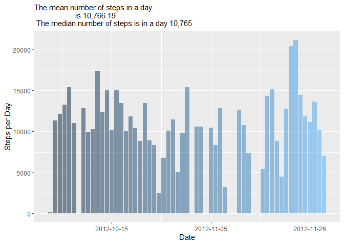
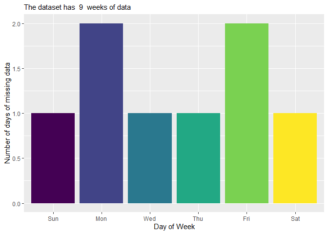
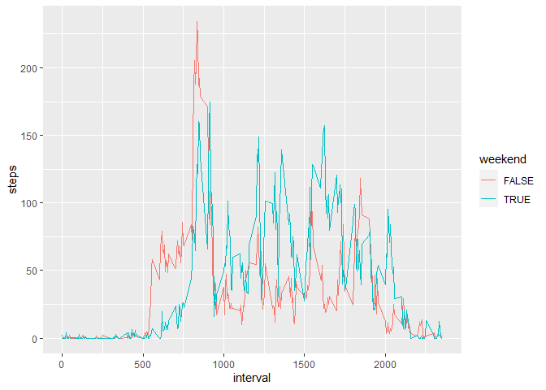
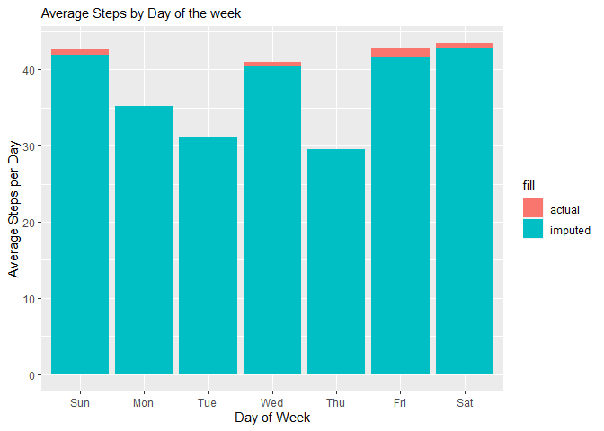

## Loading and preprocessing the data


```r
library(tidyverse)
```

```
## -- Attaching packages --------------------------------------- tidyverse 1.3.0 --
```

```
## v ggplot2 3.3.2     v purrr   0.3.4
## v tibble  3.0.4     v dplyr   1.0.2
## v tidyr   1.1.2     v stringr 1.4.0
## v readr   1.4.0     v forcats 0.5.0
```

```
## -- Conflicts ------------------------------------------ tidyverse_conflicts() --
## x dplyr::filter() masks stats::filter()
## x dplyr::lag()    masks stats::lag()
```

```r
library(ggplot2)
library(lubridate)
```

```
## 
## Attaching package: 'lubridate'
```

```
## The following objects are masked from 'package:base':
## 
##     date, intersect, setdiff, union
```

```r
filename <- "activity.csv"

mydata <- read.csv(filename, header = TRUE)
## make a lubridate, remove na values, calculate total steps
cleandata <- mydata %>%
  mutate(the_date = ymd(date)) %>%
  filter(complete.cases(.))
totalsteps <- aggregate(steps ~ the_date, cleandata, sum)
```


## What is mean total number of steps taken per day?

```r
themean.actual = mean(totalsteps$steps)
themedian.actual = median(totalsteps$steps)
themean=  prettyNum(round(themean.actual,2),big.mark = ",")
themedian = prettyNum(themedian.actual, big.mark = ",")
ggplot(totalsteps, aes(x=as_date(the_date), y=steps, 
                              fill= as_date(the_date),
                     alpha = 0.2,
                      label = round(steps,0))) +
  geom_bar(stat="identity") + 
  labs(y="Steps per Day", x = "Date",
        subtitle = paste("The mean number of steps in a day
                    is", themean,"\n The median number of steps is in a day", themedian)) +
        theme(legend.position = "none") +
        scale_x_date(date_breaks = "3 weeks") 
```

<!-- -->


## What is the average daily activity pattern?
The average daily pattern shows the average number of steps in an interval of the day. Previously, we looked at the total number of steps organized by date.  Now we are looking across all the days to find an average pattern.

```r
meansteps <- aggregate(steps~interval, cleandata, mean)
## time series plot 5 minute intervals on x axis and
## average number of steps taken across all days y
## which 5 minute interval, on average across all days, 
## contains the max number of steps
maxinterval <- meansteps[which.max(meansteps$steps), "interval"]
maxsteps <- prettyNum(round(max(meansteps$steps), 1), big.mark = ",")

ggplot(meansteps, aes(x = interval, y = steps)) +
  geom_line() +
  labs(
    y = "average steps", x = "time intervals",
    subtitle = paste("The maximum average steps
                    is", maxsteps, "\n In interval", maxinterval)
  ) +
  theme(legend.position = "none")
```

<!-- -->

## Imputing missing values

The above calculations were made after omitting missing values.  Missing values can be inferred using numerous methods.  The simplest is to replace every missing value with an overall average.  One primary factor to consider is what is the purpose of inferring (manufacturing) missing values.  It makes sense to do so when trying to make an image appear better or trying to predict what the missing data might show. 

```r
missing_step_values <- prettyNum(sum(is.na(mydata$steps)), big.mark = ",")

## days missing the most values
missing_by_date <- mydata %>%
  mutate(nostepdata = is.na(steps), the_date = ymd(date)) %>%
  filter(nostepdata == TRUE)
missing_by_date <- aggregate(nostepdata ~ the_date, missing_by_date, sum)

ggplot(missing_by_date, aes(
  x = as_date(the_date),
  y = nostepdata, label = (wday(the_date, label = TRUE))
)) +
  geom_bar(stat = "identity") +
  geom_label(aes(fill = nostepdata), colour = "white", size = 3) +
  labs(
    y = "Missing step value per day",
    x = "Date",
    subtitle = paste(
      "The data set is missing ", missing_step_values,
      "step values"
    )
  )
```

<!-- -->
From the graph, the steps for an entire day appears to be there or be absent.
A strategy for filling in the missing data is to use the data from a similar day.  There is a difference in activity for weekend versus weekdays (discussed in the next section).  The days that we are missing are:

```r
which.days <- mydata %>%
  mutate(
    nostepdata = is.na(steps), the_date = ymd(date),
    the.day = wday(the_date, label = TRUE)
  ) %>%
  filter(nostepdata == TRUE) %>%
  select(-c(steps, date, interval)) %>%
  group_by(the_date) %>%
  summarise(my.day = first(the.day))
```

```
## `summarise()` ungrouping output (override with `.groups` argument)
```

```r
number.of.weeks <- ceiling(time_length(interval(
  min(cleandata$the_date),
  max(cleandata$the_date)
),
unit = "week"
))

ggplot(which.days, aes(
  x = my.day,
  fill = my.day,
  label = "Day of the week"
)) +
  geom_histogram(stat = "count") +
  guides(fill = FALSE) +
  labs(
    y = "Number of days of missing data",
    x = "Day of Week",
    subtitle = paste(
      "The dataset has ", number.of.weeks,
      " weeks of data"
    )
  )
```

```
## Warning: Ignoring unknown parameters: binwidth, bins, pad
```

<!-- -->
When we look at the average number of steps in an interval, there are no visible differences between the mean and median of the imputed versus the original data set.


```r
library(imputeTS)
```

```
## Registered S3 method overwritten by 'quantmod':
##   method            from
##   as.zoo.data.frame zoo
```

```r
library(knitr)

## make univariate imputed data based on mean

imp.data <- na_mean(mydata)

imp.mean.actual <- mean(imp.data$steps)
mean.actual <- mean(mydata$steps, na.rm = TRUE)
imp.median.actual <- median(imp.data$steps)
median.actual <- median(mydata$steps, na.rm = TRUE)

imp.mean.pretty <- prettyNum(round(imp.mean.actual, 2), big.mark = ",")

mean.pretty <- prettyNum(round(mean.actual, 2), big.mark = ",")


mm_compare <- data.frame(
  Mean = c(imp.mean.pretty, mean.pretty),
  Median = c(imp.median.actual, median.actual),
  Label = c("Imputed", "Actual"),
  Difference = c(
    imp.mean.actual - mean.actual,
    imp.median.actual - median.actual
  )
)


knitr::kable(mm_compare, caption = "Comparing Imputed and Actual values with respect to a time interval")
```


Table: Comparing Imputed and Actual values with respect to a time interval

|Mean  | Median|Label   | Difference|
|:-----|------:|:-------|----------:|
|37.38 |      0|Imputed |          0|
|37.38 |      0|Actual  |          0|
The data has the same mean and median because that was how it was created.  We can see the imputed data in this graph:

```r
ggplot_na_imputations(mydata$steps,imp.data$steps)
```

<!-- -->


## Are there differences in activity patterns between weekdays and weekends?
Lets compute an interval graph for weekdays vs weekends and see


```r
clean.datawday <- mydata %>%
  mutate(the_date = ymd(date)) %>%
  filter(complete.cases(.)) %>%
  mutate(weekend = (wday(the_date, label = TRUE) == "Sat" |
    wday(the_date, label = TRUE) == "Sun"))

datawday.mean <- clean.datawday %>%
  group_by(interval, weekend) %>%
  summarise_if(is.numeric, mean)


ggplot(datawday.mean, aes(
  x = interval, y = steps, group = weekend,
  shape = weekend,
  color = weekend
)) +
  geom_line()
```

<!-- -->

Yes, there is a visible difference between how many steps were taken and when they were taken.  We can also look at the average number of steps per day and we see a slight difference.


```r
days.steps.actual <- mydata %>%
  mutate(
    the_date = ymd(date),
    the.day = wday(the_date, label = TRUE)
  ) %>%
  filter(complete.cases(.)) %>%
  group_by(the.day) %>%
  summarise(steps = mean(steps))
```

```
## `summarise()` ungrouping output (override with `.groups` argument)
```

```r
days.steps.imp <- imp.data %>%
  mutate(
    the_date = ymd(date),
    the.day = wday(the_date, label = TRUE)
  ) %>%
  group_by(the.day) %>%
  summarise(steps = mean(steps))
```

```
## `summarise()` ungrouping output (override with `.groups` argument)
```

```r
ggplot(days.steps.actual, aes(
  x = the.day, y = steps,
  fill = "actual"
)) +
  geom_col() +
  geom_col(
    mapping = aes(x = the.day, y = steps, fill = "imputed"),
    data = days.steps.imp
  ) +
  labs(
    subtitle = "Average Steps by Day of the week",
    x = "Day of Week",
    y = "Average Steps per Day"
  )
```

<!-- -->
